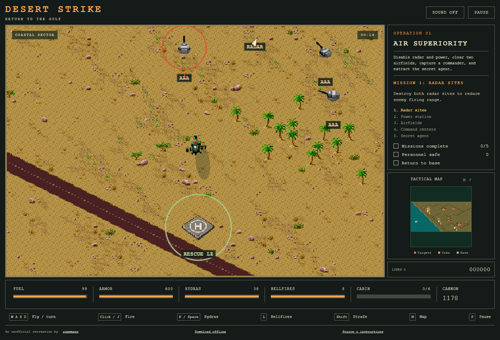

# Desert Strike: Return to the Gulf

A standalone recreation of the 1992 helicopter game, built by **agammann** with a custom JavaScript game engine, original DOS sprite artwork and Mega Drive music. Play through 27 mission objectives across the original four-campaign structure: intelligence captures, timed missile interceptions, rescues, the embassy bus escort, and the final bomber attack.

**[Play now on Sites](https://desert-strike.alx21.chatgpt.site/)** · **[GitHub Pages](https://agammann.github.io/desert-strike/)** · **[Download the offline game](https://github.com/agammann/desert-strike/releases/latest/download/Desert-Strike-offline.zip)** · **[Get the source](https://github.com/agammann/desert-strike/archive/refs/heads/main.zip)**

No ROM, emulator, account, installation, or runtime download is needed. The offline release is one self-contained HTML game that opens in a modern browser.

## Play offline

1. Download **Desert-Strike-offline.zip** above.
2. Extract the ZIP. On Windows, right-click it and choose **Extract All**.
3. Open **Desert-Strike.html** in Chrome, Edge, or Firefox. Windows users can also double-click **Play.cmd**.
4. Choose a campaign, copilot and control mode, then select **Launch operation**.

You can disconnect from the internet before opening the extracted game. Artwork, music, sound effects, missions, and code are all included. There is no local server to install or run.

## Controls

The game starts in **Standard / With Momentum**: finite supplies, documented enemy weapon values, and classic turn-and-thrust controls. **From Cockpit** responds more quickly to the throttle. For an easier first flight, choose **Relaxed / From Above**: WASD or arrow keys move in compass directions, and the copilot aims toward nearby targets when firing with J. In From Above mode, moving the mouse lets you aim manually with left click.

| Control | Action |
| :--- | :--- |
| **W / Up**, **S / Down** | Forward / reverse in classic modes; north / south in From Above |
| **A / Left**, **D / Right** | Turn in classic modes; west / east in From Above |
| **Shift + A / D** | Strafe without turning in classic modes |
| **J** or **left click** | Chain gun |
| **K** or **Space** | Hydra rockets |
| **L** | Hellfire missile; copilot can track a target ahead of the aircraft |
| **Hover over a person or crate** | Automatic rescue or supply pickup |
| **E** | Slow movement for precise pickup positioning |
| **M** | Open / close the tactical map; the action pauses |
| **P** or **Escape** | Pause / resume |
| **Enter** | Start / resume when the briefing is open |

On narrow screens, use the direction pad and **Gun / Hydra / Hellfire** buttons. A keyboard is recommended for classic flight controls. Switching tabs or windows pauses the game automatically. Sound starts muted; use **Sound off** to enable it. The title and selected campaign briefing play music; flight uses rotor and weapon sounds, with separate success, failure and ending tracks.

## Complete a campaign

Follow the **current mission** and numbered checklist beside the battlefield. The yellow map marker and edge arrow point toward the next objective. Press **M** to pause and inspect the full map. Use **Display** to select a mission, personnel, fuel, ammunition, repairs, landing zones or enemy weapons. Selected locations blink; the data panel shows the mission requirement or enemy armor and damage.

- Capture commanders and scientists to reveal hidden targets. Watch launch countdowns; opening a bunker or capturing a commander can trigger the next event.
- Stop shooting when people emerge. Hover to winch them aboard. The cabin holds **six**; deliver passengers at a marked **L** landing zone or the **H** frigate.
- Delivered personnel restore armor: 150 points each in Air Superiority, 100 in later campaigns, up to **600**. Ordinary MIAs are optional; the briefing identifies required rescues.
- In **Standard**, collect finite fuel, ammunition and repair crates scattered across the map. The frigate has no free fuel or ammo. Fuel is conserved over water. Some fuel and ammunition are concealed under destructible buildings and only appear on the map once exposed. Hidden caches also contain the quick winch and extra life. Stray fire can destroy fuel and ammunition.
- Keep clear of buildings: collisions take 10 armor from both the aircraft and object and briefly interrupt control. Circle mobile defenses, use heavy weapons carefully, and disable radar/power before attacking their protected positions. Enemy classes have different armor, damage, firing intervals, movement and aim.
- Start with **1,178 gun rounds, 38 Hydras, 8 Hellfires, and three lives**. Aircraft replacement retains passengers and ammunition. Losing every aircraft or failing a critical mission ends the operation.
- Ground missions temporarily take your copilot away, disabling automatic aiming and missile tracking. Use mouse aim or steer toward the target. For the bus, protect boarding officials from helicopter attacks, clear the gate, and fly beside it through the armor ambush.
- When every required mission is complete, **hover at the frigate** to finish. Continue to the next campaign from the results screen. Score carries forward rounded down to the nearest 1,000. The next campaign and score are saved in this browser when storage is available; **Continue operation** restores that checkpoint after reopening. This does not save an unfinished mission.

**Copilots:** X-Man has a fast winch, Aussie is balanced, Tracker offers stronger aim assistance, and Mr. D has weaker gunnery and a slower winch. Jake starts missing in action: find Valdez in campaign 1 or 2 and deliver him to the **frigate**, then choose Jake for your next operation. His unlock is remembered in this browser. Copilot assistance and pickup times are reconstruction settings.

**Relaxed** mode reduces damage and fuel use, lengthens mission timers, and restores resources at the frigate. Every campaign is selectable from the briefing.

| Campaign | Missions | Main operations |
| :--- | :---: | :--- |
| Air Superiority | 5 | Radar, power, airfields, commanders, secret-agent extraction |
| Scud Buster | 6 | Jail break, chemical complex, timed SCUD launches, POW rescue |
| Embassy City | 8 | Inspectors, biological silos, sea/yacht rescues, ambassador, bus escort |
| Nuclear Storm | 8 | Commandos, oil spills, shelters, bomb trucks, nuclear plant, palace, bomber |

Read **[the campaign guide](docs/CAMPAIGNS.md)** for every objective, rescue threshold, timer and failure condition.

## How close is it to the 1992 game?

Version **0.5.0** adds original sprite sheets, eight original music tracks, tile-based terrain reconstructed from the four map references, and the palace escape vehicle. Follow the occupied ATV to the airstrip, wait until your copilot disembarks, destroy the empty vehicle, breach the bomber, rescue him, and finish the aircraft. The nuclear complex now has two radar controllers and five Crotales. The final campaign has three hidden extra lives.

The simulation runs at **60 fixed updates per second** across different display frame rates. Scoring no longer rewards destroyed civilian trucks or scenery; bonus rescues and penalties appear in the completion report. Original numeric scoring and original-console movement timing remain unverified.

It is **not a verified one-to-one port**. The terrain grid is matched against map captures, but building, enemy and supply positions, flight coefficients, weapon ranges, mission timers, copilot assistance and encounter timing still include estimates. The supplied artwork is from the DOS version; the music is from the Mega Drive version. Some props and sound effects remain custom, and the complete original cutscenes and animations are absent. Browser checkpoints replace password entry; there is no mid-campaign save. See the **[fidelity ledger](docs/FIDELITY.md)** for sources, measurements and remaining differences. Passing a playthrough establishes completion, not identical original difficulty.

Desert Strike: Return to the Gulf is Electronic Arts' original title. This is an unofficial fan recreation, not affiliated with or endorsed by Electronic Arts. No ROM, emulator or original executable is included. **Original artwork and music are not covered by the code's MIT license.** See **[artwork and music credits](THIRD_PARTY.md)** for the creators, extraction credits and source links.

## Build and verification

See **[BUILD.md](BUILD.md)** for the dependency-free build, local development and GitHub Actions deployment. See **[VERIFIED.md](VERIFIED.md)** for the checks performed and their limits. The source implementation is available under the [MIT license](LICENSE).

